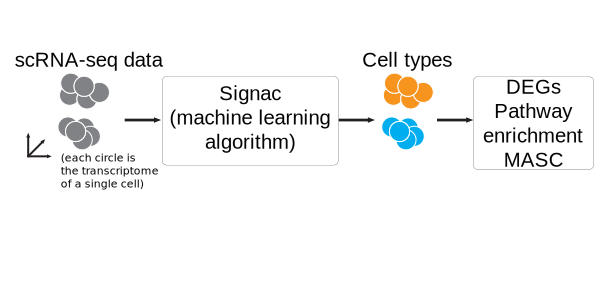

[![Contributors][contributors-shield]][contributors-url]
[![Forks][forks-shield]][forks-url]
[![Stargazers][stars-shield]][stars-url]
[![Issues][issues-shield]][issues-url]
[![GPL License][license-shield]][license-url]
[![LinkedIn][linkedin-shield]][linkedin-url]

<!-- PROJECT LOGO -->
<br />
<p align="center">
  <a href="https://www.sanofi.com/">
    
  </a>

  <h3 align="center">Signac 2.1.0</h3>

  <p align="center">
    Get the most out of your single cell data.
    <br />
    <a href="#getting-started"><strong>Explore the docs »</strong></a>
    <br />
    <br />
    <a href="https://htmlpreview.github.io/?https://github.com/mathewchamberlain/Signac/master/vignettes/signac-Seurat_CITEseq.html">View Demo</a>
    ·
    <a href="https://github.com/mathewchamberlain/Signac/issues">Report Bug</a>
    ·
    <a href="https://github.com/mathewchamberlain/Signac/issues">Request Feature</a>
  </p>
</p>


<!-- TABLE OF CONTENTS -->
## Table of Contents

* [What is Signac?](#about-the-project)
* [Getting Started](#getting-started)
  * [Installation](#installation)
  * [Quick start](#quickstart)
* [Usage](#usage)
  * [SPRING](#spring)
  * [Seurat](#seurat)
* [Roadmap](#roadmap)
* [Contributing](#contributing)
* [License](#license)
* [Contact](#contact)

<!-- ABOUT THE PROJECT -->
## What is Signac?

Signac is software developed and maintained by the Savova lab at Sanofi with a focus on single cell genomics for clinical applications. First, Signac helps solve the cell type classification problem in single cell RNA sequencing: We have gene expression profiles for each individual cell, but we do not know the cellular phenotypes. Signac classifies the cellular phenotype for each individual cell in scRNA-seq data using neural networks trained with sorted bulk gene expression data from the [Human Primary Cell Atlas](https://bmcgenomics.biomedcentral.com/articles/10.1186/1471-2164-14-632). Next, Signac identifies immune marker genes (IMAGES), and performs mixed effect modeling to identify disease-associated cell types in single cell data. Additionally, we demonstrate that Signac can classify non-human single cell data, particularly for species that lack sorted reference gene expression data. Check out the pre-print [here](https://www.biorxiv.org/content/10.1101/2021.02.01.429207v2).

To make life easier, Signac is integrated with [Seurat](https://satijalab.org/seurat/) (versions 3 and 4), [MASC](https://pubmed.ncbi.nlm.nih.gov/30333237/) and [SPRING](https://pubmed.ncbi.nlm.nih.gov/29228172/), allowing for straightforward visualization and analysis of single cell data.

<!-- GETTING STARTED -->
## Getting Started

To install Signac in R, simply do:

### Installation

```r
devtools::install_github("mathewchamberlain/Signac")
```

### Quick start

The main functions in Signac are:

```r
# load the library
library(Signac)

# Load the reference training data set
data("training_HPCA")

# Generate initial labels
labels = Signac(your_data_here, R = training_HPCA)

# Get cell type labels
celltypes = Generate_lbls(labels, your_data_here)
```

<!-- USAGE EXAMPLES -->
## Usage

Running Signac is simple. We provide a few vignettes:

### SPRING
In the [pre-print](https://www.biorxiv.org/content/10.1101/2021.02.01.429207v2), we typically used Signac integrated with [SPRING](https://pubmed.ncbi.nlm.nih.gov/29228172/), which let us easily explore cellular phenotypes identified by Signac interactively using SPRING, even for large (~100,000 cell) data. See the example notebook for [processing scRNA-seq data from 10X Genomics.](https://github.com/mathewchamberlain/Signac/blob/master/vignettes/spring_notebook_10X.ipynb) Once this notebook has been run, Signac is integrated seamlessly with the output files. Like this:

```r
# load the Signac library
library(Signac)

# dir points to the "FullDataset_v1" directory generated by the Jupyter notebook
dir = "./FullDataset_v1" 

# load the expression data
E = CID.LoadData(dir)

# load the reference data
data("training_HPCA")

# generate cellular phenotype labels
labels = Signac(E, R = training_HPCA, spring.dir = dir)
celltypes = Generate_lbls(labels, E = E)

# write cell types and Louvain clusters to SPRING
dat <- CID.writeJSON(celltypes, data.dir = dir)
```

After running these functions, cellular phenotypes and Louvain clusters are ready to be visualized with the SPRING interface, which can be setup locally as described [here](https://github.com/AllonKleinLab/SPRING_dev).

### Seurat
The easiest way to use Signac is with Seurat. [Here, we perform multi-modal analysis of CITE-seq PBMCs from 10X Genomics using Seurat and Signac.](https://htmlpreview.github.io/?https://github.com/mathewchamberlain/Signac/master/vignettes/signac-Seurat_CITEseq.html)

Sometimes, we have single cell genomics data with disease information. In that case, we present [this vignette, where we analyzed healthy and lupus nephritis kidney cells from the Accelerating Medicine Partnership (AMP) sequenced with CEL-seq2.](https://htmlpreview.github.io/?https://github.com/mathewchamberlain/Signac/master/vignettes/signac-Seurat_AMP.html) We used MASC to find that macrophages, plasma cells and CD8 central memory T cells were enriched for disease status.

### Classifying non-human data

In our pre-print, we classified cynomolgus monkey data by mapping homologous gene symbols from the Macaca fascicularis genome to the human genome, and then using Signac (which was trained with flow-sorted human data). We demonstrate how to map the gene symbols [here](https://htmlpreview.github.io/?https://github.com/mathewchamberlain/Signac/master/vignettes/Crabeating_vignette.html).

<!-- ROADMAP -->
## Roadmap

See the [open issues](https://github.com/mathewchamberlain/Signac/issues) for a list of proposed features (and known issues).

<!-- CONTRIBUTING -->
## Contributing

Contributions are what make the open source community such an amazing place to be learn, inspire, and create. Any contributions you make are **greatly appreciated**.

1. Fork the Project
2. Create your Feature Branch (`git checkout -b feature/AmazingFeature`)
3. Commit your Changes (`git commit -m 'Add some AmazingFeature'`)
4. Push to the Branch (`git push origin feature/AmazingFeature`)
5. Open a Pull Request

<!-- LICENSE -->
## License

Distributed under the GPL v3.0 License. See `LICENSE` for more information.

<!-- CONTACT -->
## Contact

Mathew Chamberlain - [linkedin](https://linkedin.com/in/chamberlainmathew) - mathew.chamberlain@sanofi.com

Project Link: [https://github.com/mathewchamberlain/Signac](https://github.com/mathewchamberlain/Signac)

<!-- MARKDOWN LINKS & IMAGES -->
<!-- https://www.markdownguide.org/basic-syntax/#reference-style-links -->
[contributors-shield]: https://img.shields.io/github/contributors/mathewchamberlain/Signac.svg?style=flat-square
[contributors-url]: https://github.com/mathewchamberlain/Signac/graphs/contributors
[forks-shield]: https://img.shields.io/github/forks/mathewchamberlain/Signac.svg?style=flat-square
[forks-url]: https://github.com/mathewchamberlain/Signac/network/members
[stars-shield]: https://img.shields.io/github/stars/mathewchamberlain/Signac.svg?style=flat-square
[stars-url]: https://github.com/mathewchamberlain/Signac/stargazers
[issues-shield]: https://img.shields.io/github/issues/mathewchamberlain/Signac.svg?style=flat-square
[issues-url]: https://github.com/mathewchamberlain/Signac/issues
[license-shield]: https://img.shields.io/github/license/mathewchamberlain/Signac.svg?style=flat-square
[license-url]: https://choosealicense.com/licenses/gpl-3.0/
[linkedin-shield]: https://img.shields.io/badge/-LinkedIn-black.svg?style=flat-square&logo=linkedin&colorB=555
[linkedin-url]: https://linkedin.com/in/chamberlainmathew
[product-screenshot]: images/screenshot.png
[](https://github.com/Cigaras/IPTV.bundle/releases)
