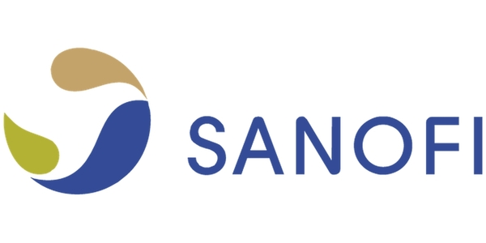

[![Contributors][contributors-shield]][contributors-url]
[![Forks][forks-shield]][forks-url]
[![Stargazers][stars-shield]][stars-url]
[![Issues][issues-shield]][issues-url]
[![GPL License][license-shield]][license-url]
[![LinkedIn][linkedin-shield]][linkedin-url]

<!-- PROJECT LOGO -->
<br />
<p align="center">
  <a href="https://www.sanofi.com/">
    
  </a>

  <h3 align="center">Signac</h3>

  <p align="center">
    Get the most out of your single cell data.
    <br />
    <a href="https://htmlpreview.github.io/?https://github.com/mathewchamberlain/Signac/master/vignettes/signac-Seurat_CITEseq.html"><strong>Explore the docs »</strong></a>
    <br />
    <br />
    <a href="https://htmlpreview.github.io/?https://github.com/mathewchamberlain/Signac/master/vignettes/signac-Seurat_CITEseq.html">View Demo</a>
    ·
    <a href="https://github.com/mathewchamberlain/Signac/issues">Report Bug</a>
    ·
    <a href="https://github.com/mathewchamberlain/Signac/issues">Request Feature</a>
  </p>
</p>


<!-- TABLE OF CONTENTS -->
## Table of Contents

* [What is Signac?](#about-the-project)
  * [Built With](#built-with)
* [Getting Started](#getting-started)
  * [Installation](#installation)
* [Usage](#usage)
* [Roadmap](#roadmap)
* [Contributing](#contributing)
* [License](#license)
* [Contact](#contact)
* [Acknowledgements](#acknowledgements)


<!-- ABOUT THE PROJECT -->
## What is Signac?

Signac helps solve the cell type classification problem in single cell RNA sequencing: We often have an expression matrix and we need to classify the cellular phenotypes. Signac classifies them using neural networks trained with sorted bulk data. Check out our pre-print here.

<!-- GETTING STARTED -->
## Getting Started

To install Signac in R, simply do:

### Installation

```r
devtools::install_github("mathewchamberlain/Signac")
```

### Quick start

The main functions in Signac are:

```r
data(training_HPCA)
labels = Signac(your_data_here, R = training_HPCA) # Seurat object or expression matrix
celltypes = Generate_lbls(labels, your_data_here) # celltypes will have the cellular phenotype labels for each cell in your data.
```

The easiest way to use Signac is to integrate it with Seurat or with SPRING.

<!-- USAGE EXAMPLES -->
## Usage

Running Signac is simple. We provide a few vignettes:

* [Signac and Seurat: Multi-modal analysis of CITE-seq PBMCs from 10X Genomics (https://htmlpreview.github.io/?https://github.com/mathewchamberlain/Signac/master/vignettes/signac-Seurat_CITEseq.html).

<!-- ROADMAP -->
## Roadmap

See the [open issues](https://github.com/mathewchamberlain/Signac/issues) for a list of proposed features (and known issues).

<!-- CONTRIBUTING -->
## Contributing

Contributions are what make the open source community such an amazing place to be learn, inspire, and create. Any contributions you make are **greatly appreciated**.

1. Fork the Project
2. Create your Feature Branch (`git checkout -b feature/AmazingFeature`)
3. Commit your Changes (`git commit -m 'Add some AmazingFeature'`)
4. Push to the Branch (`git push origin feature/AmazingFeature`)
5. Open a Pull Request

<!-- LICENSE -->
## License

Distributed under the GPL v3.0 License. See `LICENSE` for more information.

<!-- CONTACT -->
## Contact

Mathew Chamberlain - [linkedin](https://linkedin.com/in/chamberlainmathew) - mathew.chamberlain@sanofi.com

Project Link: [https://github.com/mathewchamberlain/Signac](https://github.com/mathewchamberlain/Signac)

<!-- MARKDOWN LINKS & IMAGES -->
<!-- https://www.markdownguide.org/basic-syntax/#reference-style-links -->
[contributors-shield]: https://img.shields.io/github/contributors/mathewchamberlain/Signac.svg?style=flat-square
[contributors-url]: https://github.com/mathewchamberlain/Signac/graphs/contributors
[forks-shield]: https://img.shields.io/github/forks/mathewchamberlain/Signac.svg?style=flat-square
[forks-url]: https://github.com/mathewchamberlain/Signac/network/members
[stars-shield]: https://img.shields.io/github/stars/mathewchamberlain/Signac.svg?style=flat-square
[stars-url]: https://github.com/mathewchamberlain/Signac/stargazers
[issues-shield]: https://img.shields.io/github/issues/mathewchamberlain/Signac.svg?style=flat-square
[issues-url]: https://github.com/mathewchamberlain/Signac/issues
[license-shield]: https://img.shields.io/github/license/mathewchamberlain/Signac.svg?style=flat-square
[license-url]: https://choosealicense.com/licenses/gpl-3.0/
[linkedin-shield]: https://img.shields.io/badge/-LinkedIn-black.svg?style=flat-square&logo=linkedin&colorB=555
[linkedin-url]: https://linkedin.com/in/chamberlainmathew
[product-screenshot]: images/screenshot.png
