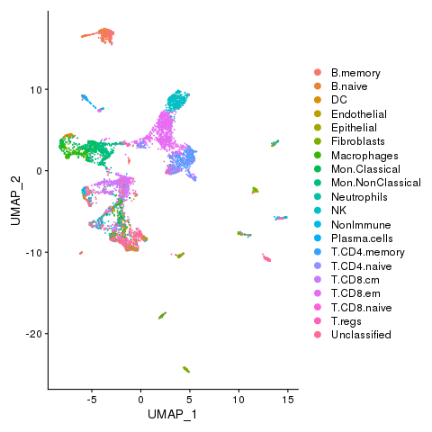
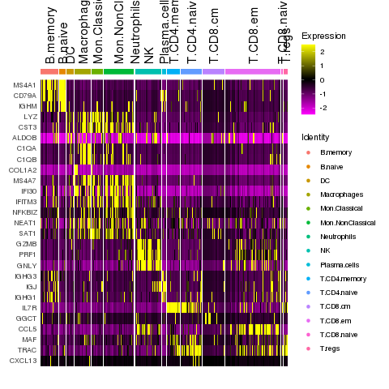

This vignette shows how to use SignacX with Seurat and MASC. There are three parts: Seurat, SignacX and then MASC. We use an example data set of kidney cells from AMP from [this publication](https://www.ncbi.nlm.nih.gov/pmc/articles/PMC6726437/).

```{r setup0, include=FALSE}
all_times <- list()  # store the time for each chunk
knitr::knit_hooks$set(time_it = local({
  now <- NULL
  function(before, options) {
    if (before) {
      now <<- Sys.time()
    } else {
      res <- difftime(Sys.time(), now, units = "secs")
      all_times[[options$label]] <<- res
    }
  }
}))
knitr::opts_chunk$set(
  tidy = TRUE,
  tidy.opts = list(width.cutoff = 95),
  message = FALSE,
  warning = FALSE,
  time_it = TRUE
)
# kidney = readRDS(kidney, file = "fls/amp_kidney_signac.rds")
Q = readRDS(file = "fls/amp_kidney_MASC_result.rds")
celltypes = readRDS(file = "fls/amp_kidney_celltypes.rds")
```

## Load data

Read the CEL-seq2 data.

```{r read CELSeq2, message = F, eval = F}
ReadCelseq <- function (counts.file, meta.file)
{
  E = suppressWarnings(readr::read_tsv(counts.file));
  gns <- E$gene;
  E = E[,-1]
  M = suppressWarnings(readr::read_tsv(meta.file))
  S = lapply(unique(M$sample), function(x) {
    logik = colnames(E) %in% M$cell_name[M$sample == x]
    Matrix::Matrix(as.matrix(E[,logik]), sparse = TRUE)}
    )
  names(S) <- unique(M$sample)
  S = lapply(S, function(x){
    rownames(x) <- gns
    x
  })
  S
}

counts.file = "./SDY997_EXP15176_celseq_matrix_ru10_molecules.tsv.gz"
meta.file = "./SDY997_EXP15176_celseq_meta.tsv"

E = ReadCelseq(counts.file = counts.file, meta.file = meta.file)
M = suppressWarnings(readr::read_tsv(meta.file))
```

Merge into a single matrix

```{r filter celseq, message = F, eval = F}
# keep only kidney cells
E = lapply(E, function(x){
  x[,grepl("K", colnames(x))]
})

# remove any sample with no cells
E = E[sapply(E, ncol) > 0]

# merge into a single matrix
E = do.call(cbind, E)
```

## Seurat 

Start with the standard pre-processing steps for a Seurat object.

```{r setupSeurat, message = F, eval = F}
library(Seurat)
```

Create a Seurat object, and then perform SCTransform normalization. Note:

* You can use the legacy functions here (i.e., NormalizeData, ScaleData, etc.), use SCTransform or any other normalization method (including no normalization). We did not notice a significant difference in cell type annotations with different normalization methods.
* We think that it is best practice to use SCTransform, but it is not a necessary step. Signac will work fine without it.

```{r Seurat, message = T, eval = F}
# load data
kidney <- CreateSeuratObject(counts = E, project = "celseq")

# run sctransform
kidney <- SCTransform(kidney)
```

Perform dimensionality reduction by PCA and UMAP embedding. Note:

* SignacX actually needs these functions since it uses the nearest neighbor graph generated by Seurat.

```{r Seurat 2, message = T, eval = F}
# These are now standard steps in the Seurat workflow for visualization and clustering
kidney <- RunPCA(kidney, verbose = FALSE)
kidney <- RunUMAP(kidney, dims = 1:30, verbose = FALSE)
kidney <- FindNeighbors(kidney, dims = 1:30, verbose = FALSE)
```

## SignacX

First, make sure that you have the SignacX package installed.

```{r setup signacX, message = F, eval = F}
install.packages("SignacX")
```

Generate cellular phenotype labels for the Seurat object. Note:

* Optionally, you can do parallel computing by setting num.cores > 1 in the Signac function.
* Run time is ~10 minutes for ~10,000 cells on a single core.

```{r Signac, message = T, eval = F}
# Run Signac
library(SignacX)
labels <- Signac(kidney, num.cores = 4)
celltypes = GenerateLabels(labels, E = kidney)
```

## Visualizations

Now we can visualize the cell type classifications at many different levels:

```{r Seurat Visualization 0, eval = F}
kidney <- AddMetaData(kidney, metadata=celltypes$Immune, col.name = "immmune")
kidney <- SetIdent(kidney, value='immmune')
png(filename="fls/plot1_amp.png")
DimPlot(kidney)
dev.off()
```


```{r Seurat Visualization 2, eval = F}
kidney <- AddMetaData(kidney, metadata=celltypes$CellTypes, col.name = "celltypes")
kidney <- SetIdent(kidney, value='celltypes')
png(filename="fls/plot2_amp.png")
DimPlot(kidney)
dev.off()
```


```{r Seurat Visualization 3, eval = F}
kidney <- AddMetaData(kidney, metadata=celltypes$CellStates, col.name = "cellstates")
kidney <- SetIdent(kidney, value='cellstates')
png(filename="fls/plot3_amp.png")
DimPlot(kidney)
dev.off()
```


Identify immune marker genes (IMAGES)

```{r Seurat get IMAGES, message = F, eval = F}
# Downsample just the immune cells
kidney.small <- kidney[, !celltypes$CellStates %in% c("NonImmune", "Fibroblasts", "Unclassified", "Endothelial", "Epithelial")]

# Find protein markers for all clusters, and draw a heatmap
markers <- FindAllMarkers(kidney.small, only.pos = TRUE, verbose = F, logfc.threshold = 1)
require(dplyr)
top5 <- markers %>%  group_by(cluster) %>% top_n(n = 5, wt = avg_logFC)
png(filename="fls/plot4_amp.png", width = 640, height = 640)
DoHeatmap(kidney.small, features = unique(top5$gene), angle = 90)
dev.off()
```


## Run MASC
```{r MASC, message = F, eval = F}
Meta_mapped = M[match(colnames(kidney), M$cell_name), ]
Meta_mapped$CellStates = celltypes$CellStates
Meta_mapped$disease = factor(Meta_mapped$disease)
Q = MASC(dataset = Meta_mapped, cluster = Meta_mapped$CellStates, contrast = 'disease', random_effects = c("plate", "lane", "sample"))
```

MASC results reveals that fibroblasts, plasma cells and B memory cells are enriched (p value < 0.05) for disease.

```{r, results='asis', echo = F}
writeLines("td, th { padding : 6px } th { background-color : brown ; color : white; border : 1px solid white; } td { color : brown ; border : 1px solid brown }", con = "mystyle.css")
knitr::kable(Q, format = "html")
```

Save results
```{r save results, message = F, eval = F}
saveRDS(kidney, file = "fls/amp_kidney_signac.rds")
saveRDS(Q, file = "fls/amp_kidney_MASC_result.rds")
saveRDS(celltypes, file = "fls/amp_kidney_celltypes.rds")
```

```{r save.times, include = FALSE, eval = F}
write.csv(x = t(as.data.frame(all_times)), file = "fls/tutorial_times_signac-Seurat_AMP.csv")
```

<details>
  <summary>**Session Info**</summary>
```{r, echo=FALSE}
sessionInfo()
```
</details>