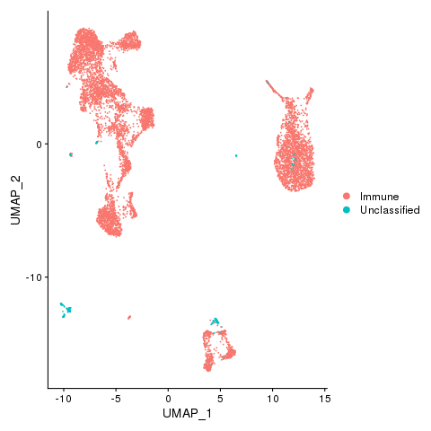
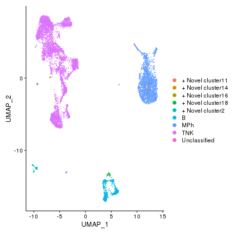
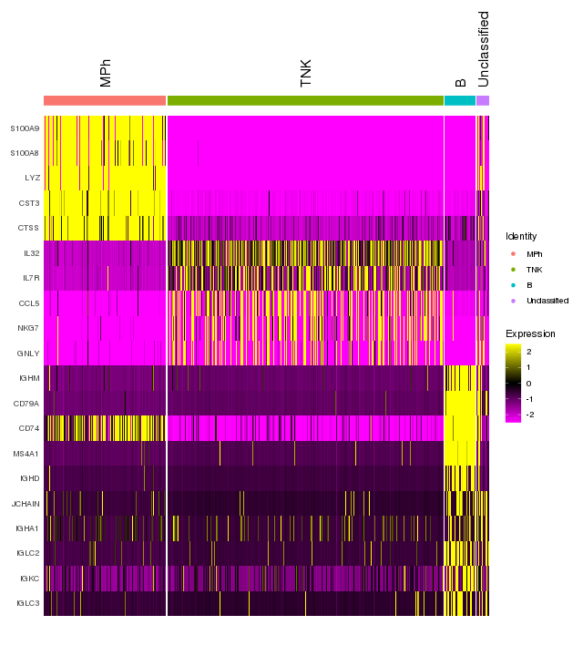
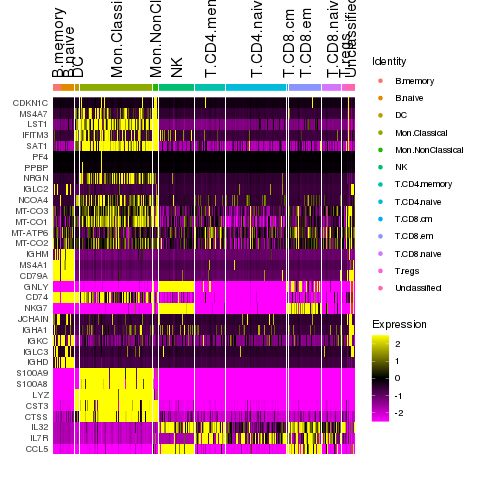
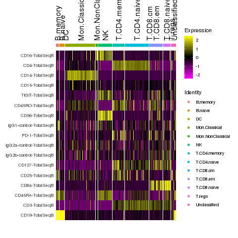

```{r setup0, include=FALSE}
all_times <- list()  # store the time for each chunk
knitr::knit_hooks$set(time_it = local({
  now <- NULL
  function(before, options) {
    if (before) {
      now <<- Sys.time()
    } else {
      res <- difftime(Sys.time(), now, units = "secs")
      all_times[[options$label]] <<- res
    }
  }
}))
knitr::opts_chunk$set(
  tidy = TRUE,
  tidy.opts = list(width.cutoff = 95),
  message = FALSE,
  warning = FALSE,
  time_it = TRUE
)
celltypes_fast = readRDS("./fls/celltypes_fast_citeseq.rds")
celltypes = readRDS("./fls/celltypes_citeseq.rds")
# pbmc = readRDS("fls/pbmcs_signac_citeseq.rds")
```

This vignette shows how to use Signac with Seurat. There are three parts: Seurat, Signac and then visualization. We use an example PBMCs CITE-seq data set from 10X Genomics.

## Seurat 

Start with the standard pre-processing steps for a Seurat object.

```{r setupSeurat, message = F, eval = F}
library(Seurat)
```

Download data from 10X Genomics.

```{r setup, message = F, eval = F}
dir.create("fls")
download.file("https://cf.10xgenomics.com/samples/cell-exp/3.0.0/pbmc_10k_protein_v3/pbmc_10k_protein_v3_filtered_feature_bc_matrix.h5", destfile = "fls/pbmc_10k_protein_v3_filtered_feature_bc_matrix.h5")
```

Create a Seurat object, and then perform SCTransform normalization. Note:

* You can use the legacy functions here (i.e., NormalizeData, ScaleData, etc.), use SCTransform or any other normalization method (including no normalization). We did not notice a significant difference in cell type annotations with different normalization methods.
* We think that it is best practice to use SCTransform, but it is not a necessary step. SignacX will work fine without it.

```{r Seurat, message = T, eval = F}
# load dataset
E = Read10X_h5(filename = "fls/pbmc_10k_protein_v3_filtered_feature_bc_matrix.h5")
pbmc <- CreateSeuratObject(counts = E$`Gene Expression`, project = "pbmc")

# run sctransform
pbmc <- SCTransform(pbmc)
```

Perform dimensionality reduction by PCA and UMAP embedding. Note:

* SignacX actually needs these functions since it uses the nearest neighbor graph generated by Seurat.

```{r Seurat 2, message = T, eval = F}
# These are now standard steps in the Seurat workflow for visualization and clustering
pbmc <- RunPCA(pbmc, verbose = FALSE)
pbmc <- RunUMAP(pbmc, dims = 1:30, verbose = FALSE)
pbmc <- FindNeighbors(pbmc, dims = 1:30, verbose = FALSE)
```

## SignacX

Load the package

```{r Signac setup folder, message = T, eval = F}
require(SignacX)
```

Generate SignacX labels for the Seurat object. Note:

* Optionally, you can do parallel computing by setting num.cores > 1 in the Signac function.
* Run time is ~10-20 minutes for <100,000 cells.

```{r Signac, message = T, eval = F}
# Run Signac
labels <- Signac(pbmc, num.cores = 4)
celltypes = GenerateLabels(labels, E = pbmc)
```

<details>
  <summary>**Can we make Signac faster?**</summary>

Sometimes, training the neural networks takes a lot of time. To make Signac faster, we implemented SignacFast which uses an ensemble of pre-trained neural network models. Note:

* SignacFast uses an ensemble of 1,800 pre-calculated neural networks using the GenerateModels function together with the training_HPCA reference data.
* Features that are absent from the single cell data and present in the neural network are set to zero.

```{r SignacFast, message = T, eval = F}
# Run Signac
labels_fast <- SignacFast(pbmc)
celltypes_fast = GenerateLabels(labels_fast, E = pbmc)
```

SignacFast took only ~30 seconds. Relative to Signac, the main difference is that SignacFast tends to leave a few more cells "Unclassified."
</details>

<details>
  <summary>**How does SignacFast compare to Signac?**</summary>
```{r, echo=FALSE, eval = T}
knitr::kable(table(Signac = celltypes$CellTypes, SignacFast = celltypes_fast$CellTypes), format = "html")
```
</details>

## Visualizations

Now we can visualize the cell type classifications at many different levels:
Immune and nonimmune
```{r Seurat Visualization 0, message = F, eval = F}
pbmc <- AddMetaData(pbmc, metadata=celltypes_fast$Immune, col.name = "immmune")
pbmc <- SetIdent(pbmc, value='immmune')
png(filename="fls/plot1_citeseq.png")
DimPlot(pbmc)
dev.off()
```


```{r Seurat Visualization 1, message = F, eval = F}
pbmc <- AddMetaData(pbmc, metadata=celltypes$L2, col.name = "celltypes")
pbmc <- SetIdent(pbmc, value='celltypes')
png(filename="fls/plot2_citeseq.png")
DimPlot(pbmc)
dev.off()
```


```{r Seurat Visualization 2, message = F, eval = F}
pbmc <- AddMetaData(pbmc, metadata=celltypes$CellTypes, col.name = "celltypes")
pbmc <- SetIdent(pbmc, value='celltypes')
png(filename="./fls/plot3_citeseq.png")
DimPlot(pbmc)
dev.off()
```


```{r Seurat Visualization 3, message = F, eval = F}
pbmc <- AddMetaData(pbmc, metadata=celltypes$CellTypes_novel, col.name = "celltypes_novel")
pbmc <- SetIdent(pbmc, value='celltypes_novel')
png(filename="./fls/plot4_citeseq.png")
DimPlot(pbmc)
dev.off()
```


```{r Seurat Visualization 4, message = F, eval = F}
pbmc <- AddMetaData(pbmc, metadata=celltypes$CellStates, col.name = "cellstates")
pbmc <- SetIdent(pbmc, value='cellstates')
png(filename="./fls/plot5_citeseq.png")
DimPlot(pbmc)
dev.off()
```


Identify differentially expressed genes between cell types.

```{r Seurat visualize protein 33, message = F, eval = F}
pbmc <- SetIdent(pbmc, value='celltypes')

# Find markers for all clusters, and draw a heatmap
markers <- FindAllMarkers(pbmc, only.pos = TRUE, verbose = F, logfc.threshold = 1)
library(dplyr)
top5 <- markers %>%  group_by(cluster) %>% top_n(n = 5, wt = avg_logFC)

png(filename="./fls/plot9_citeseq.png", width = 640, height = 720)
DoHeatmap(pbmc, features = unique(top5$gene), angle = 90)
dev.off()
```


```{r Seurat visualize protein 3333, message = F, eval = F}
pbmc <- SetIdent(pbmc, value='cellstates')

# Find markers for all clusters, and draw a heatmap
markers <- FindAllMarkers(pbmc, only.pos = TRUE, verbose = F, logfc.threshold = 1)
top5 <- markers %>%  group_by(cluster) %>% top_n(n = 5, wt = avg_logFC)

png(filename="./fls/plot6_citeseq.png", width = 640, height = 720)
DoHeatmap(pbmc, features = unique(top5$gene), angle = 90)
dev.off()
```

Add protein expression information

```{r Seurat add protein, eval = F}
pbmc[["ADT"]] <- CreateAssayObject(counts = E$`Antibody Capture`[,colnames(E$`Antibody Capture`) %in% colnames(pbmc)])
pbmc <- NormalizeData(pbmc, assay = "ADT", normalization.method = "CLR")
pbmc <- ScaleData(pbmc, assay = "ADT")
```

Identify differentially expressed proteins between clusters

```{r Seurat visualize protein 3, eval = F}
DefaultAssay(pbmc) <- "ADT"
# Find protein markers for all clusters, and draw a heatmap
adt.markers <- FindAllMarkers(pbmc, assay = "ADT", only.pos = TRUE, verbose = F)
png(filename="./fls/plot7_citeseq.png", width = 640, height = 720)
DoHeatmap(pbmc, features = unique(adt.markers$gene), angle = 90)
dev.off()
```


Save results

```{r save results, message = F, eval = F}
saveRDS(pbmc, file = "fls/pbmcs_signac_citeseq.rds")
saveRDS(celltypes, file = "fls/celltypes_citeseq.rds")
saveRDS(celltypes_fast, file = "fls/celltypes_fast_citeseq.rds")
```


```{r save.times, include = FALSE, eval = F}
write.csv(x = t(as.data.frame(all_times)), file = "fls/tutorial_times_signac-Seurat_citeseq.csv")
```

<details>
  <summary>**Session Info**</summary>
```{r, echo=FALSE}
sessionInfo()
```
</details>
